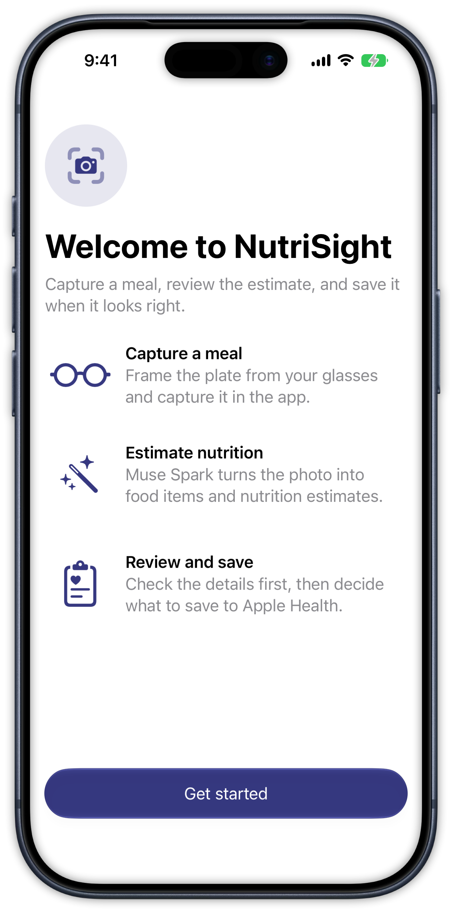
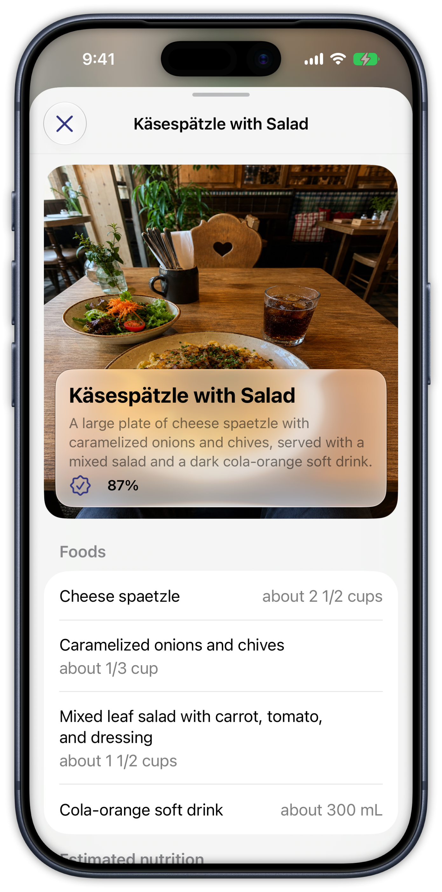
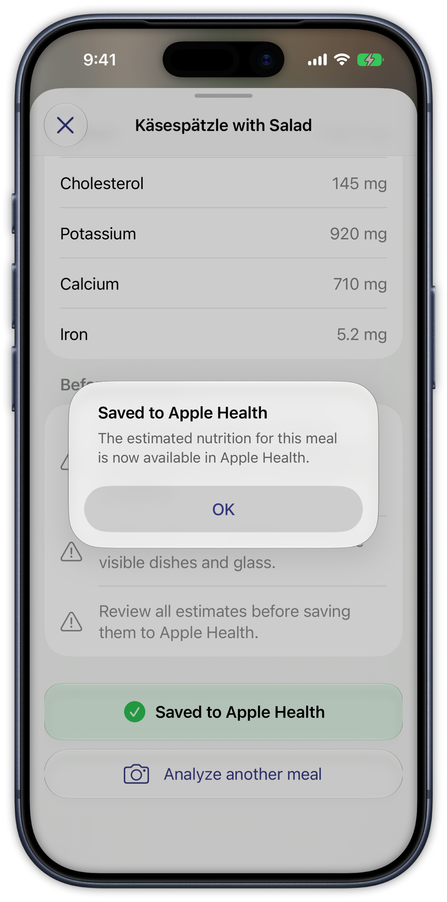

<!--

This source file is part of the NutriSight project

SPDX-FileCopyrightText: 2026 Stanford University and the project authors (see CONTRIBUTORS.md)

SPDX-License-Identifier: MIT

-->

# NutriSight

NutriSight is an iOS prototype that captures a meal from Meta glasses or the iPhone camera, generates a structured nutrition estimate with Meta's Muse Spark model, and lets the user review the estimate before saving supported nutrients to Apple Health.

> [!IMPORTANT]
> Nutrition values are model-generated estimates, not medical advice. Review every result before saving it to Apple Health.


## Core Features

- Guided pairing and camera-permission flow for Meta glasses
- Live meal capture from Meta glasses, a simulated glasses feed, or the iPhone camera
- Structured food, portion, nutrient, confidence, and uncertainty estimates
- Review-first Apple Health export using HealthKit
- Deterministic sample analysis and simulated media for development and testing


<table>
  <tr>
    <td></td>
    <td></td>
    <td></td>
    <td></td>
  </tr>
  <tr>
    <td align="center">Onboard</td>
    <td align="center">Capture</td>
    <td align="center">Review</td>
    <td align="center">Save</td>
  </tr>
</table>


## Getting Started

### Requirements

- Xcode 26 or newer
- An iPhone or iOS Simulator running iOS 26 or newer
- For the glasses workflow: supported Meta glasses with developer mode enabled
- For live nutrition estimates: a [Meta Model API key](https://dev.meta.ai/docs/getting-started/overview)

### Simulator Quick Start

1. Clone the repository and open `NutriSight.xcodeproj`.
2. Select the `NutriSight` scheme and an iPhone simulator.
3. Build and run the app.
4. During onboarding, choose **Sample Analysis** and **Simulated Glasses**.
5. Capture the bundled Käsespätzle meal and review the generated nutrition estimate.
6. Grant Health access when prompted to exercise the complete save flow against the simulator's Health database.

The simulator path requires no glasses, API key, or network connection. **iPhone Camera** is also available as a capture source.

### Physical Device and Meta Glasses

1. Select your development team and, if necessary, use a bundle identifier registered to that team.
2. Enable developer mode for the Meta glasses.
3. Run NutriSight on the iPhone and enter a Meta Model API key during onboarding.
4. Select the glasses, grant glasses-camera access, capture a meal, and review the estimate before saving.

No Meta developer app, App ID, callback registration, or `Info.plist` placeholder replacement is required.

For this prototype, the model API key is entered on-device and stored in the Keychain. A production deployment should issue short-lived credentials through a trusted backend instead of shipping or storing a long-lived service credential.


## Architecture and Testing

`WearablesCoordinator` exposes the high-level pairing, permission, connection, streaming, and capture API. `DeviceSessionManager` owns the underlying Meta device-session lifecycle so SDK objects do not leak into feature views.

The shared `NutriSight.xctestplan` contains Swift Testing unit tests and end-to-end UI tests backed by Meta's Mock Device Kit, deterministic model responses, and an in-memory HealthKit writer.

Run the same single-simulator test lane used by CI:

```sh
fastlane test
```


## Contributing

Contributions to this project are welcome. Please read the [Contributor Covenant Code of Conduct](https://github.com/SchmiedmayerLab/.github/blob/main/CODE_OF_CONDUCT.md) first.


## License

This project is licensed under the MIT License. See [Licenses](LICENSES) for more information.


## Our Research

For more information, visit the [Schmiedmayer Lab GitHub organization](https://github.com/SchmiedmayerLab).


